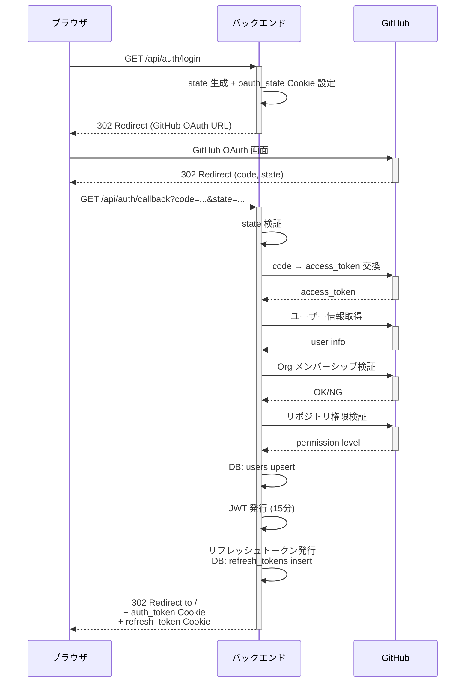
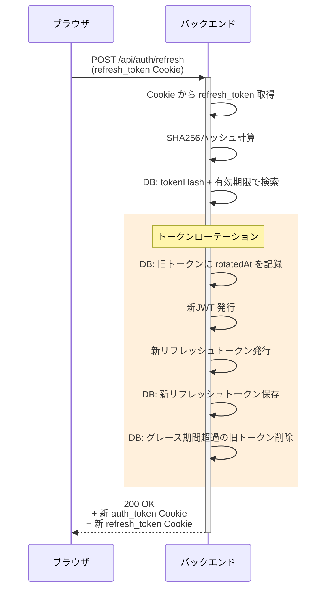
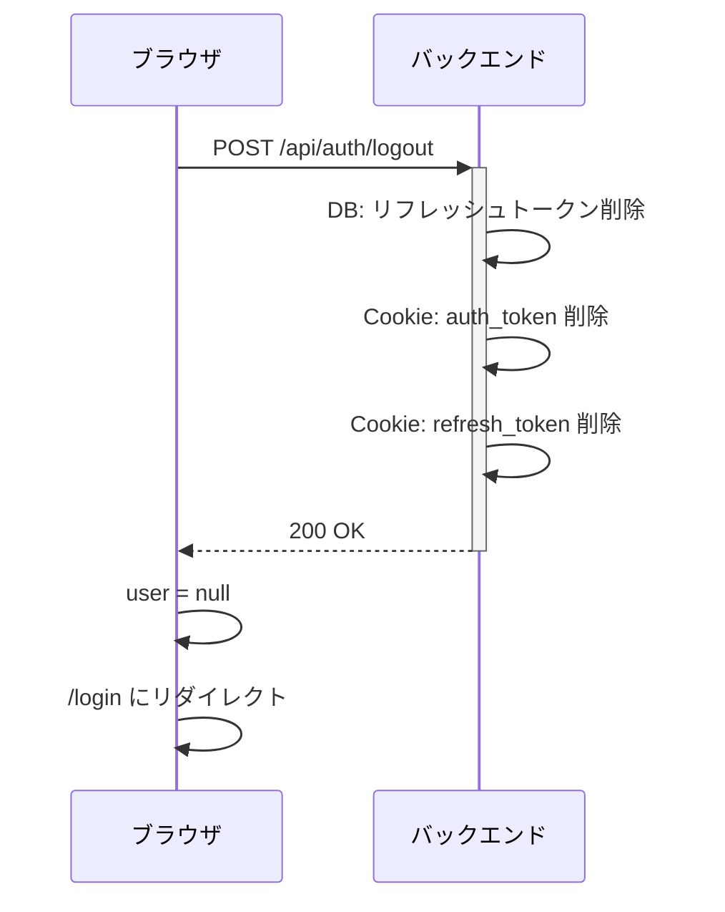

# 認証フロー アーキテクチャ

## 概要

GitHub App OAuth による認証。JWT + リフレッシュトークンの2トークン方式。
Organization メンバーシップとリポジトリ write 権限の検証を含む。

## 関連ファイル

| ファイル | 役割 |
|---------|------|
| `backend/src/routes/auth.ts` | 認証エンドポイント (login, callback, refresh, logout, me) |
| `backend/src/services/github.ts` | GitHub OAuth + API 呼び出し |
| `backend/src/middlewares/auth.ts` | JWT 検証ミドルウェア |
| `backend/src/utils/jwt.ts` | JWT 署名・検証 (jose, HS256) |
| `backend/src/utils/crypto.ts` | セキュアトークン生成, SHA256ハッシュ |
| `frontend/src/stores/auth.ts` | 認証状態管理 (Pinia) |
| `frontend/src/router/index.ts` | ナビゲーションガード |
| `frontend/src/composables/useApi.ts` | 401 ハンドリング |

## OAuth フロー



## トークン仕様

### JWT (auth_token)

| 項目 | 値 |
|-----|---|
| アルゴリズム | HS256 |
| 有効期限 | 15分 |
| Cookie パス | `/` |
| Cookie 属性 | `httpOnly`, `sameSite: Lax`, `secure` (本番のみ) |

ペイロード:
```json
{
  "sub": "ユーザーID (UUID)",
  "githubLogin": "github-username",
  "githubId": 12345,
  "iat": 1234567890,
  "exp": 1234568790
}
```

### リフレッシュトークン (refresh_token)

| 項目 | 値 |
|-----|---|
| 形式 | 64バイト暗号学的乱数 (hex) |
| 有効期限 | 30日 |
| Cookie パス | `/api/auth` |
| DB保存 | SHA256 ハッシュのみ |

## トークンリフレッシュ



**トークンローテーション**: リフレッシュのたびに旧トークンの `rotatedAt` を記録し新トークンを発行。
漏洩したトークンの再利用を防止。

**グレース期間** (30秒): 複数タブが同時にリフレッシュした場合の競合を防止するため、
ローテーション済みトークンも30秒間は有効として扱う。グレース期間を過ぎたトークンは
次回リフレッシュ時にクリーンアップされる。

## フロントエンドの認証管理

### 初期化フロー

```typescript
// router/index.ts - ナビゲーションガード
router.beforeEach(async (to, _from, next) => {
  const authStore = useAuthStore()
  if (!authStore.initialized) {
    await authStore.initialize()  // GET /api/auth/me
  }
  // 認証チェック → リダイレクト判定
})
```

### 認証状態 (Pinia ストア)

```typescript
// stores/auth.ts
const user = ref<User | null>(null)       // ユーザー情報 (認証済みなら非null)
const initialized = ref(false)            // 初期化済みフラグ (二重実行防止)
const isAuthenticated = computed(() => !!user.value)
```

### 401 ハンドリング（自動リフレッシュ＆リトライ）

```typescript
// composables/useApi.ts
if (response.status === 401) {
  if (!_isRetry) {
    const refreshed = await refreshAuthToken()
    if (refreshed) {
      return request<T>(url, options, true) // リトライ
    }
  }
  window.location.href = '/login'
}
```

API リクエストが 401 を返した場合、まず `/api/auth/refresh` でトークンリフレッシュを試みる。
リフレッシュ成功時は元のリクエストを自動リトライする（1回のみ）。
リフレッシュも失敗した場合（リフレッシュトークンの期限切れ等）にログイン画面へリダイレクトする。
複数リクエストが同時に 401 を受けた場合、リフレッシュはモジュールレベルの排他制御により1回だけ実行される。

### プロアクティブリフレッシュ

```typescript
// stores/auth.ts
const REFRESH_INTERVAL = 13 * 60 * 1000 // 13分
```

JWT の有効期限（15分）が切れる前に、バックグラウンドで定期的にトークンをリフレッシュする。

- **定期リフレッシュ:** 13分間隔（15分 - 2分バッファ）で `/api/auth/refresh` を呼び出し
- **タブ復帰時リフレッシュ:** `visibilitychange` イベントを監視し、タブがフォアグラウンドに戻った際にリフレッシュを実行
- リフレッシュ失敗時は認証状態をクリア（`user = null`）し、タイマーを停止

### 初期化時のリフレッシュ

ページリロード時に JWT が期限切れでも、リフレッシュトークンが有効であれば自動復帰する。
`initialize()` で `/api/auth/me` が 401 を返した場合、リフレッシュを試みてからリトライする。

## ログアウト



## セキュリティ考慮事項

- JWT シークレットは 32文字以上を強制 (Zod バリデーション)
- リフレッシュトークンはハッシュのみ DB に保存 (平文保存しない)
- OAuth state パラメータで CSRF 防止
- Cookie は `httpOnly` で XSS からの読み取りを防止
- `sameSite: Lax` で CSRF を軽減
- 本番環境では `secure` フラグで HTTPS 通信を強制
