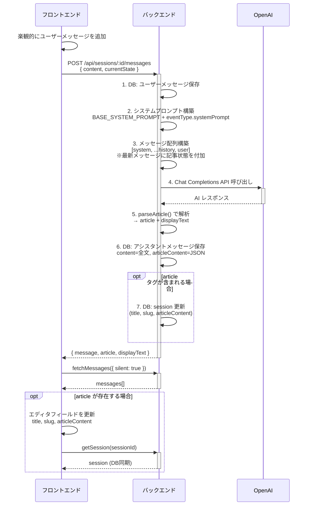

# チャット・LLM 連携アーキテクチャ

## 概要

ユーザーとLLM (OpenAI gpt-4o-mini) のチャットを通じて記事作成を支援する。
LLM が `<article>` タグで記事内容を提案すると、自動的にエディタに反映される。

## 関連ファイル

| ファイル | 役割 |
|---------|------|
| `backend/src/services/chat/chat-service.ts` | チャット処理の中核 (メッセージ組み立て + API呼び出し + 結果保存) |
| `backend/src/services/chat/openai-client.ts` | OpenAI API ラッパー |
| `backend/src/services/chat/article-parser.ts` | `<article>` タグのパーサー |
| `backend/src/routes/chat.ts` | エンドポイント定義 |
| `frontend/src/composables/useChat.ts` | チャット composable (送受信 + 楽観的UI) |
| `frontend/src/components/session-edit/ChatPane.vue` | チャットUI |
| `frontend/src/components/session-edit/ChatMessage.vue` | メッセージ表示 (article除去) |

## メッセージ送信フロー



## システムプロンプト構造

| 区分 | ソース | 内容 |
|------|--------|------|
| `BASE_SYSTEM_PROMPT` | `chat-service.ts` にハードコード | 記事作成支援アシスタントとしての役割定義、`<article>` タグの使用方法指示、タイトルとURLの実例 (slug命名の参考)、`<article>` タグ外での会話指示、ユーザーへの返事を含める指示 |
| `eventType.systemPrompt` | DB (`event_types.system_prompt`) | イベント種類固有の指示 (例: 「うみねこ会の開催報告記事を...」) |

この2つを `\n\n` で結合してシステムプロンプトとする。

## OpenAI API へ送信するメッセージ配列

```typescript
[
  // 1. システムプロンプト
  { role: 'system', content: systemPrompt },

  // 2. チャット履歴 (時系列)
  { role: 'user', content: '最初のメッセージ' },
  { role: 'assistant', content: 'AIの返答 (articleタグ含む全文)' },
  { role: 'user', content: '2番目のメッセージ' },
  // ...

  // 3. 最新のユーザーメッセージ (記事状態付き)
  { role: 'user', content: `ユーザーのメッセージ

【現在の記事状態】
タイトル: 記事タイトル
slug: article-slug
本文:
Markdown本文...` }
]
```

**重要:** 記事状態コンテキストは最新のユーザーメッセージにのみ付加。
過去のメッセージには付加しない。

## `<article>` タグ仕様

### LLM が出力する形式

```xml
通常の返答テキスト（ユーザーへの返事）

<article>
<title>記事のタイトル</title>
<slug>article_slug</slug>
<content>
Markdown形式の記事本文
</content>
</article>
```

### パーサー (`article-parser.ts`)

```typescript
parseArticle(text: string): {
  article: ParsedArticle | null  // 抽出結果
  displayText: string            // <article>除去後のテキスト
}
```

正規表現で抽出:
- `<article>` ブロック全体: `/<article>([\s\S]*?)<\/article>/`
- 内部タグ: `/<title>([\s\S]*?)<\/title>/`, `/<slug>...`, `/<content>...`

`ParsedArticle` の各フィールドは `optional`。LLMが一部のみ出力する場合がある。

### フロントエンド側の除去

```typescript
// useChat.ts
export function stripArticleFromDisplay(text: string): string {
  return text.replace(/<article>[\s\S]*?<\/article>/, '').trim()
}
```

`ChatMessage.vue` で表示する際、`<article>` ブロックを除去してチャット欄に表示。

## データ保存

### chat_messages テーブル

| カラム | 内容 |
|--------|------|
| `content` | LLM応答の**全文** (`<article>` タグ含む) |
| `article_content` | 抽出された article の JSON 文字列 (なければ null) |

全文を保存する理由: 過去のチャット履歴をそのまま OpenAI API に再送するため。

### sessions テーブル

article が抽出された場合、セッションの以下フィールドを更新:
- `title` (article.title が存在する場合)
- `slug` (article.slug が存在する場合)
- `article_content` (article.content が存在する場合)

## フロントエンドの状態更新

### 通常フロー (sendMessage の結果)

```typescript
// SessionEditView.vue - handleSendMessage
const result = await sendMessage(content, { title, slug, articleContent })
if (result.article) {
  if (result.article.title !== undefined) title.value = result.article.title
  if (result.article.slug !== undefined) slug.value = result.article.slug
  if (result.article.content !== undefined) articleContent.value = result.article.content
  session.value = await getSession(sessionId) // DB同期
}
```

### ポーリングフロー (画面復帰時)

ユーザーが送信後に画面を離れて戻った場合、ポーリングで応答を検出:

```typescript
// 2秒間隔でメッセージ再取得
pollTimer = setInterval(async () => {
  await fetchMessages({ silent: true })
  const latest = messages.value[messages.value.length - 1]
  if (latest && latest.role === 'assistant') {
    // 応答検出 → セッション再取得でエディタフィールド更新
    session.value = await getSession(sessionId)
    title.value = session.value.title
    slug.value = session.value.slug
    articleContent.value = session.value.articleContent
  }
}, 2000)
```

## 楽観的UI更新

チャット送信時、API レスポンスを待たずにユーザーメッセージを即座に表示:

```typescript
// useChat.ts - sendMessage
const tempUserMsg: ChatMessage = {
  id: `temp-${Date.now()}`,  // 一時ID
  sessionId,
  role: 'user',
  content,
  articleContent: null,
  createdAt: new Date().toISOString(),
}
messages.value = [...messages.value, tempUserMsg]
```

API 完了後に `fetchMessages({ silent: true })` で DB の正式データに差し替え。

## 変更時の注意点

- **システムプロンプト変更**: `BASE_SYSTEM_PROMPT` は `chat-service.ts` にハードコード。slug の例や指示を変更する場合はここを編集
- **`<article>` タグ構造変更**: `article-parser.ts` (バックエンド) と `useChat.ts` の `stripArticleFromDisplay` (フロントエンド) の両方を更新
- **新しい article フィールド追加**: `ParsedArticle` 型, パーサー, `chat-service.ts` のセッション更新, `SessionEditView.vue` の反映ロジックをすべて更新
- **LLM モデル変更**: `openai-client.ts` の `model` パラメータを変更
