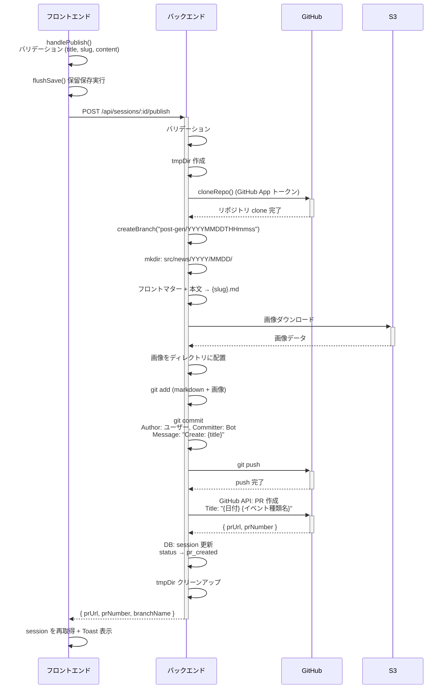
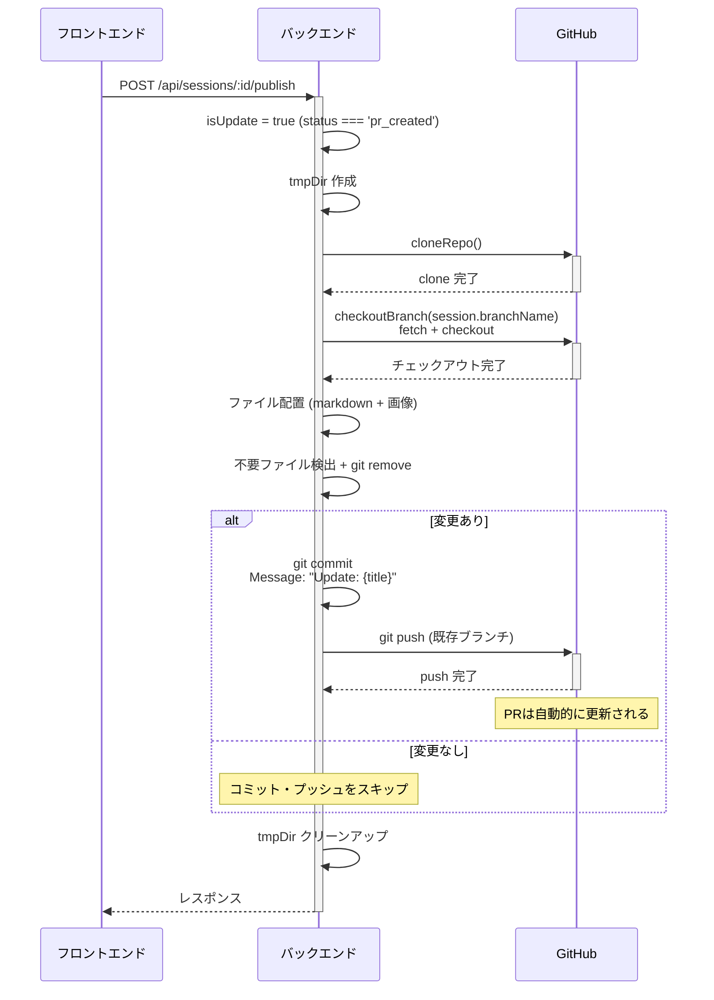

# 公開ワークフロー (PR作成/更新)

## 概要

記事の公開は isomorphic-git による Git 操作と GitHub API による PR 作成で実現。
初回公開と PR 作成後の再編集で処理が分岐する。

## 関連ファイル

| ファイル | 役割 |
|---------|------|
| `backend/src/routes/publish.ts` | エンドポイント定義 |
| `backend/src/services/git/publish-service.ts` | 公開ワークフロー本体 |
| `backend/src/services/git/git-service.ts` | isomorphic-git ラッパー |
| `backend/src/services/git/github-api.ts` | GitHub App API (PR作成, botコミッター) |
| `backend/src/services/storage/s3-service.ts` | S3から画像ダウンロード |
| `frontend/src/views/SessionEditView.vue` | 公開ボタン + バリデーション |

## 全体フロー

### 初回公開 (draft → pr_created)



### PR作成後の再編集 (pr_created → 追加コミット)



## 生成されるファイル構造

```
src/news/YYYY/MMDD/
├── {slug}.md           # 記事本文 (フロントマター付き)
├── image1.jpg          # アップロード画像
├── image2.png
└── eyecatch.jpg
```

### フロントマター形式

```yaml
---
title: "記事タイトル"
date: YYYY-MM-DD
eyecatch: ./eyecatch.jpg
---

Markdown本文...
```

- `title`: ダブルクォートで囲む
- `date`: YYYY-MM-DD 形式
- `eyecatch`: eyecatch 設定された画像がある場合のみ出力 (相対パス `./`)

## ブランチ命名規則

```
post-gen/YYYYMMDDTHHmmss
```

例: `post-gen/20250115T143022`

## コミット情報

| 項目 | 初回 | 更新 |
|-----|------|------|
| メッセージ | `Create: {title}` | `Update: {title}` |
| Author | ユーザーの GitHub 情報 | 同左 |
| Committer | GitHub App bot | 同左 |

Author のメール形式: `{githubId}+{githubLogin}@users.noreply.github.com`
Committer は `getAppBotCommitter()` で GitHub App の情報を取得。

## PR 情報

| 項目 | 値 |
|-----|---|
| タイトル | `{YYYY年M月D日} {イベント種類名}` |
| 本文 | `{日付}に実施した『{イベント種類名}』の報告記事を追加します` |
| ベースブランチ | リポジトリのデフォルトブランチ |

## 更新時の不要ファイル削除

PR更新時、以前コミットした画像が削除されていた場合の処理:

```typescript
// 1. 記事ディレクトリ内の既存ファイル一覧を取得
const existingFiles = listFilesInDir(fullArticleDir)

// 2. Markdown ファイルはスキップ
if (filename === `${session.slug}.md`) continue

// 3. 現在のセッション画像に含まれないファイルを削除対象に
if (!currentImageFilenames.has(filename)) {
  filesToRemove.push(`${articleDir}/${filename}`)
}

// 4. git remove で追跡から外す + ファイル削除
await removeFiles(tmpDir, filesToRemove)
```

## 変更なしの場合

更新時に `hasStagedChanges()` で変更を検出。
変更がなければコミット・プッシュをスキップして早期リターン。

## 一時ディレクトリ管理

```typescript
const tmpDir = fs.mkdtempSync(path.join(os.tmpdir(), 'article-supporter-'))
try {
  // ... Git操作
} finally {
  fs.rmSync(tmpDir, { recursive: true, force: true })
}
```

エラー発生時も `finally` で必ずクリーンアップ。

## isomorphic-git の認証

GitHub App のインストールトークンを使用:

```typescript
// git-service.ts
export async function cloneRepo(dir: string, depth: number = 1) {
  const token = await getInstallationToken()
  await git.clone({
    fs, dir, http,
    url: `https://github.com/${env.GITHUB_OWNER}/${env.GITHUB_REPO}`,
    onAuth: () => ({ username: 'x-access-token', password: token }),
    depth,
  })
  return token
}
```

`onAuth` コールバックで `x-access-token` ユーザー名 + インストールトークンを返す。

## マージ検知

セッション詳細取得時 (`GET /api/sessions/:id`) に PR の状態を確認:

```typescript
// routes/sessions.ts (セッション取得時)
if (session.status === 'pr_created' && session.prNumber) {
  // GitHub API で PR の状態を確認
  const prState = await checkPrState(session.prNumber)
  if (prState === 'merged') {
    // DB を更新
    await updateSessionStatus(session.id, 'merged')
    session.status = 'merged'
  }
}
```

マージ済みになるとフロントエンド側で編集不可になる。
