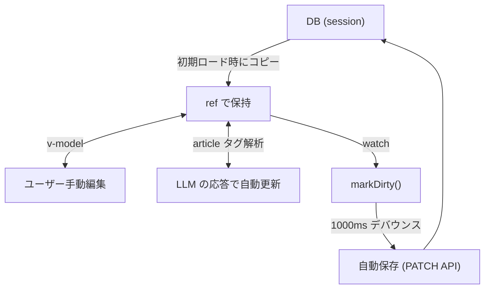
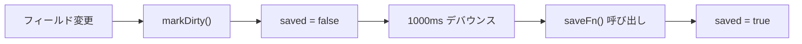
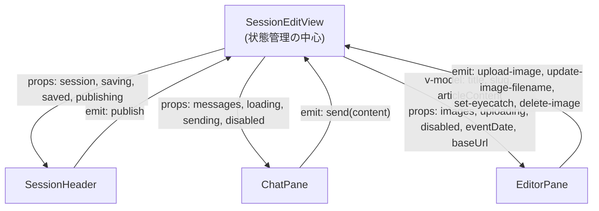

# セッション編集画面のステート管理

## 概要

`SessionEditView.vue` はアプリケーションで最も複雑なステート管理を持つ画面。
チャット、エディタ、画像管理、自動保存、PR公開の状態を統合的に管理する。

## 画面構成

```
SessionEditView.vue (状態オーケストレーター)
├── SessionHeader.vue   ← session, saving, saved, publishing
├── ChatPane.vue        ← messages, loading, sending, disabled
│   └── ChatMessage.vue ← 個別メッセージ表示
└── EditorPane.vue      ← title, slug, articleContent, images, uploading, disabled
    ├── MarkdownPreview.vue
    └── ImageList.vue
        └── ImageCard.vue
```

## 状態の分類

### 1. セッションデータ (DB由来)

```typescript
// SessionEditView.vue
const session = ref<Session | null>(null)      // DBから取得したセッション本体
const loadingSession = ref(true)               // 初期ロード中フラグ
```

`session` はヘッダー表示 (イベント種類、日付、PR状態) に使用。
直接編集はせず、エディタフィールドにコピーして使う。

### 2. エディタフィールド (編集可能な状態)

```typescript
const title = ref<string | null>(null)
const slug = ref<string | null>(null)
const articleContent = ref<string | null>(null)
```

**データの流れ:**



**重要:** `loadingSession.value` が `true` の間は watch による `markDirty()` を抑制。
初期ロード時のデータセットで自動保存が発火しないようにしている:

```typescript
watch(title, () => { if (!loadingSession.value) markDirty() })
watch(slug, () => { if (!loadingSession.value) markDirty() })
watch(articleContent, () => { if (!loadingSession.value) markDirty() })
```

### 3. チャット状態 (useChat composable)

```typescript
const { messages, loading, sending, fetchMessages, sendMessage } = useChat(sessionId)
```

| 状態 | 型 | 説明 |
|-----|---|------|
| `messages` | `Ref<ChatMessage[]>` | 時系列のチャット履歴 |
| `loading` | `Ref<boolean>` | 履歴ロード中 |
| `sending` | `Ref<boolean>` | メッセージ送信中 (LLM応答待ち) |

**楽観的UI更新:**
1. ユーザーメッセージ送信時、`temp-{timestamp}` IDで即座に `messages` に追加
2. API レスポンス受信後、`fetchMessages({ silent: true })` で DB の正式データに差し替え

### 4. 画像状態 (useImages composable)

```typescript
const { images, uploading, setImages, uploadImage, updateImage, deleteImage } = useImages(sessionId)
```

- 初期データは `session.images` から `setImages()` で設定
- アップロード/削除後は `images` を直接更新 (楽観的)
- eyecatch 変更・画像削除後は `getSession()` でセッション全体をリフレッシュ

### 5. 自動保存状態 (useAutoSave composable)

```typescript
const { saving, saved, markDirty, save: flushSave } = useAutoSave(saveFn, 1000)
```

| 状態 | 説明 |
|-----|------|
| `saving` | API呼び出し中 |
| `saved` | 最後の保存以降に変更なし |

**フロー:**



**フラッシュ:** PR公開前に `flushSave()` を呼び、保留中の保存を即座に実行。

### 6. 公開状態

```typescript
const publishing = ref(false)
```

PR作成/更新中のローディングフラグ。`handlePublish()` 内で管理。

## ポーリング機構

ページ遷移前にユーザーがメッセージを送信し、応答待ちのまま画面を離れて戻ったケースに対応。

```typescript
// onMounted内
const lastMsg = messages.value[messages.value.length - 1]
if (lastMsg && lastMsg.role === 'user') {
  // 最後のメッセージがユーザー = アシスタント応答待ち
  sending.value = true
  pollTimer = setInterval(async () => {
    await fetchMessages({ silent: true })
    const latest = messages.value[messages.value.length - 1]
    if (latest && latest.role === 'assistant') {
      // 応答を受信 → ポーリング停止 + エディタ更新
      sending.value = false
      clearInterval(pollTimer)
      session.value = await getSession(sessionId)
      // article内容をエディタに反映
    }
  }, 2000)
}
```

`onUnmounted` でタイマーをクリーンアップ。

## LLM応答によるエディタ更新

```typescript
async function handleSendMessage(content: string) {
  const result = await sendMessage(content, {
    title: title.value,
    slug: slug.value,
    articleContent: articleContent.value,
  })

  if (result.article) {
    // <article> タグから抽出された値でエディタを更新
    if (result.article.title !== undefined) title.value = result.article.title
    if (result.article.slug !== undefined) slug.value = result.article.slug
    if (result.article.content !== undefined) articleContent.value = result.article.content
    session.value = await getSession(sessionId) // DB側も同期
  }
}
```

**注意:** `title.value` への代入は `watch` を発火し、`markDirty()` → 自動保存が走る。
ただしバックエンドの `chat-service.ts` が既にセッションを更新済みなので、
自動保存は同じ値の上書き (冪等) となり問題ない。

## マージ済みセッションの制御

```typescript
const isMerged = computed(() => session.value?.status === 'merged')
```

`isMerged` が `true` の場合:
- `ChatPane` に `disabled` を渡す → チャット入力欄を非表示
- `EditorPane` に `disabled` を渡す → 全入力欄を readonly
- `SessionHeader` で PR更新ボタンを非表示

## コンポーネント間のデータフロー図



## 変更時の注意点

- **エディタフィールドの追加**: `watch` による `markDirty()` の追加と、`handleSendMessage` 内の article 反映ロジックの両方を更新すること
- **自動保存の saveFn**: `updateSession` に渡すフィールドを更新すること
- **ポーリング**: 応答受信後のエディタ更新ロジックも忘れずに更新すること
- **初期ロード抑制**: 新しいフィールドの watch にも `if (!loadingSession.value)` ガードを追加すること
